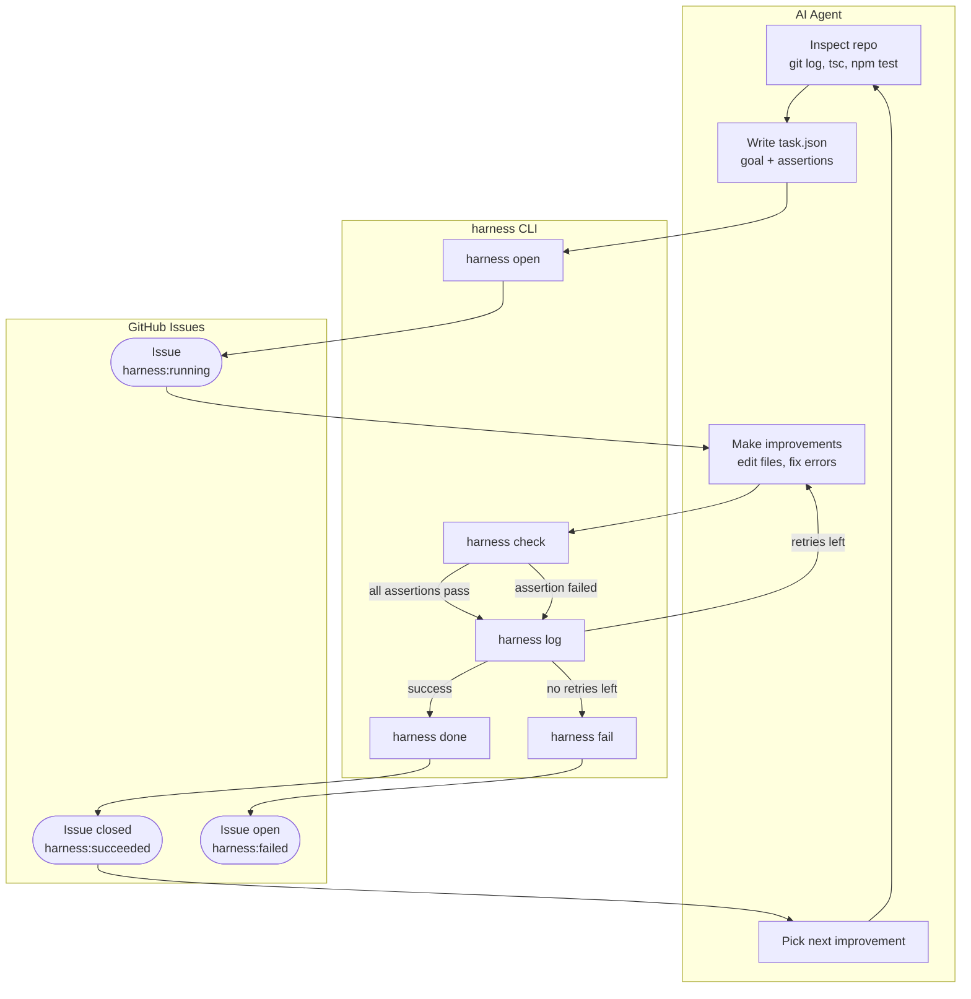

# harness-arena

**Self-correcting loop coordinator for AI coding agents.**

The AI agent is the brain — it inspects repos, decides what to improve, and makes the changes. harness is the body — it tracks progress on GitHub Issues and verifies whether the work actually succeeded.



No LLM bundled. Bring your own agent (Cursor, Claude Code, any coding AI).

---

## Install

```bash
git clone https://github.com/theadamlabs/harness-arena
cd harness-arena
npm install && npm run build
npm install -g .
```

Requires `GITHUB_TOKEN` env var for GitHub Issues observability.

---

## Commands

```bash
harness open   <task.json>                   # open tracking issue → { number, url }
harness check  <task.json>                   # run assertions → PASS/FAIL per assertion
harness log    <issue-number> "<message>"    # add a comment to the issue
harness done   <issue-number> [attempts]     # close issue as succeeded
harness fail   <issue-number> [attempts]     # mark issue as failed (leave open)
harness help                                 # full reference
```

---

## Task format

```json
{
  "goal":       "Fix all TypeScript type errors in src/",
  "repo":       "owner/repo",
  "workdir":    "/absolute/path/to/repo",
  "assertions": [
    { "type": "shell", "command": "npx tsc --noEmit", "expect": { "exitCode": 0 } },
    { "type": "shell", "command": "npm test",          "expect": { "exitCode": 0 } },
    { "type": "file",  "path": "dist/index.js",        "expect": { "exists": true } }
  ]
}
```

Assertions define what success looks like. The AI agent decides how to get there.

### Assertion types

**`shell`** — runs a command and checks its output:

| field         | type    | meaning                                      |
|---------------|---------|----------------------------------------------|
| `command`     | string  | shell command to run                         |
| `cwd`         | string  | working directory override (optional)        |
| `exitCode`    | number  | expected exit code, default `0`              |
| `contains`    | string  | stdout+stderr must include this string       |
| `notContains` | string  | stdout+stderr must NOT include this string   |

**`file`** — inspects a file on disk:

| field         | type    | meaning                              |
|---------------|---------|--------------------------------------|
| `path`        | string  | path relative to `workdir`           |
| `exists`      | boolean | file must or must not exist          |
| `contains`    | string  | file content must include string     |
| `notContains` | string  | file content must NOT include string |

---

## GitHub Issues observability

| Event                     | GitHub action                                        |
|---------------------------|------------------------------------------------------|
| `harness open`            | Creates issue, label `harness:running`               |
| `harness log`             | Adds a comment (attempts, errors, diffs)             |
| `harness done`            | Closes issue, label `harness:succeeded`              |
| `harness fail`            | Leaves issue open, label `harness:failed`            |

Labels are created automatically on first `open`.

---

## Environment

| Variable       | Purpose                                          |
|----------------|--------------------------------------------------|
| `GITHUB_TOKEN` | Required for all GitHub API calls                |
| `GITHUB_REPO`  | Fallback `owner/repo` if `task.repo` is not set  |

---

## Project structure

```
src/
  types.ts     — Task, Assertion, CheckResult interfaces
  checker.ts   — assertion evaluation (shell + file, read-only)
  reporter.ts  — GitHub Issues via @octokit/rest
  index.ts     — CLI entry point
SKILL.md       — agent usage guide (auto-installed to ~/.cursor/skills/)
```

---

## License

MIT
