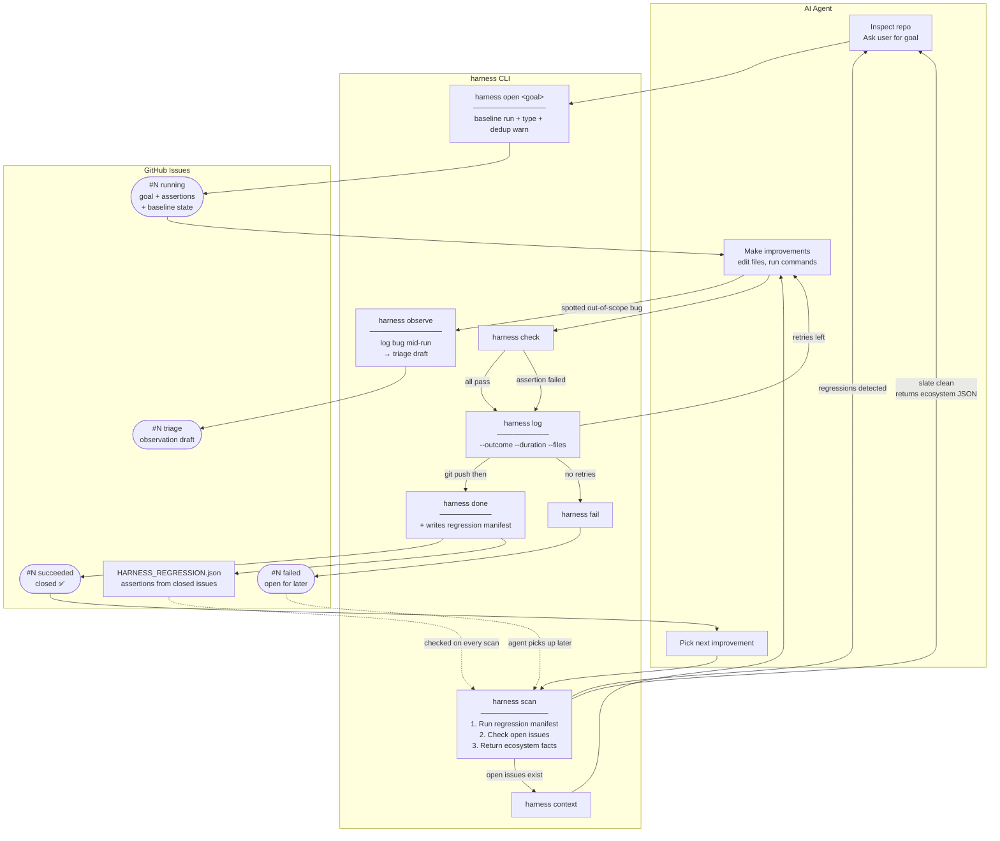

# harness-arena

**Make any software project continuously better — autonomously, across unlimited sessions and agents.**

harness is a loop coordinator and GitHub Issues tracker for AI coding agents. The loop closes itself: scan → goal → work → verify → ship → scan again. Each closed issue leaves the codebase measurably better than before, and leaves a regression guard so it stays that way.

No LLM bundled. Bring your own agent (Cursor, Claude Code, any coding AI).



---

## Install

```bash
git clone https://github.com/theadamlabs/harness-arena
cd harness-arena
npm install && npm run build
npm install -g .
```

Requires `GITHUB_TOKEN` for GitHub Issues. `GITHUB_REPO=owner/repo` is optional — harness auto-detects the repo from `git remote get-url origin`.

---

## Usage

```bash
# 1. Scan — checks regressions, then open issues, then ecosystem
harness scan ./my-repo

# 2. Inspect repo, decide goal with the user, open a tracking issue
#    (baseline run happens automatically; warns if similar issue exists)
harness open "Fix all TypeScript strict errors" \
  --workdir ./my-repo \
  --type correctness \
  --assert "npx tsc --noEmit"

# 3. Read prior context before starting (skip on first attempt)
harness context <issue>

# 4. Do the work — edit files, run commands

# 5. Mid-run: spotted a bug out of scope? Log it without derailing the active issue
harness observe "scroll fails on LinkedIn inner container"

# 6. Verify assertions
harness check <issue>

# 7. Log, push, then close — done appends assertions to HARNESS_REGRESSION.json
harness log <issue> "Fixed 12 type errors." --outcome pass --duration 180 --files src/api.ts
git add -A && git commit -m "fix: resolve TypeScript strict errors" && git push
harness done <issue> 1
```

See [SKILL.md](./SKILL.md) for the full autonomous loop guide.

---

## Commands

```bash
harness scan    <workdir> [--repo R] [--goal "..."]
  # 1. Runs HARNESS_REGRESSION.json assertions (regressions from closed issues)
  # 2. Checks for open harness issues → resume hint
  # 3. Returns ecosystem facts for agent to decide goal
  # With --goal: opens issue immediately (baseline run included)

harness open    "<goal>" [--repo R] [--workdir P] [--type TYPE] [--assert "cmd"]...
  # TYPE: fix | correctness | performance | workflow | spike
  # Runs baseline before creating issue. Warns on fuzzy title match.

harness check   <issue>  [--workdir override]    # run assertions, PASS/FAIL + stdout/stderr
harness log     <issue>  "<message>" [--outcome pass|fail|blocked] [--duration <s>] [--files a,b]
harness context <issue>                          # read goal + config + all prior attempts
harness history [--repo R]                       # list all harness issues
harness done    <issue>  [attempts]              # close ✅ + write to HARNESS_REGRESSION.json
harness fail    <issue>  [attempts]              # mark ❌, leave open
harness observe "<observation>" [--repo R]       # create triage draft mid-workflow
harness help                                     # full reference
```

---

## How it works

The issue body stores everything harness needs in a hidden HTML comment:

```
<!-- harness:config
{"workdir":"/path/to/repo","assertions":[{"type":"shell","command":"npx tsc --noEmit","expect":{"exitCode":0}}],"type":"correctness"}
-->
```

`harness check 42` fetches the issue, extracts the config, runs the assertions, and returns the full result including stdout/stderr — so the agent immediately sees what failed without a second command.

`harness done` reads the same config and appends the assertions to `HARNESS_REGRESSION.json` in the workdir. Every future `harness scan` runs these assertions first. Regressions surface before any new work starts.

---

## Assertion types

**`shell`** — run a command, check its output:

| field         | meaning                                      |
|---------------|----------------------------------------------|
| `command`     | shell command to run                         |
| `exitCode`    | expected exit code, default `0`              |
| `contains`    | stdout+stderr must include this string       |
| `notContains` | stdout+stderr must NOT include this string   |
| `cwd`         | directory override (relative to workdir)     |

**`file`** — inspect a file on disk:

| field         | meaning                              |
|---------------|--------------------------------------|
| `path`        | path relative to workdir             |
| `exists`      | file must or must not exist          |
| `contains`    | file content must include string     |
| `notContains` | file content must NOT include string |

---

## Ecosystem auto-detection (`harness scan`)

`harness scan` reads the directory and generates sensible assertions automatically:

| Detected files                    | Ecosystem         | Assertions generated                        |
|-----------------------------------|-------------------|---------------------------------------------|
| `package.json` + `tsconfig.json`  | TypeScript/Node   | `tsc --noEmit`, eslint, `npm test`          |
| `package.json`                    | Node.js           | `npm test` or `node --check <main>`         |
| `Cargo.toml`                      | Rust              | `cargo check`, `cargo clippy`, `cargo test` |
| `pyproject.toml` / `setup.py`     | Python            | ruff, mypy (if configured), `pytest`        |
| `go.mod`                          | Go                | `go build`, `go vet`, `go test`             |
| `Makefile`                        | Make              | `make test`, `make lint`, `make build`      |

---

## GitHub Issues observability

| Event              | GitHub action                                                             |
|--------------------|---------------------------------------------------------------------------|
| `harness scan`     | Runs regression manifest; checks open issues; returns ecosystem JSON      |
| `harness open`     | Runs baseline assertions; creates issue with config + baseline; warns on similar titles |
| Duplicate goal     | Returns existing open issue instead of creating new                       |
| `harness log`      | Adds structured comment (outcome, duration, files, freetext)              |
| `harness done`     | Closes issue (`harness:succeeded`); appends assertions to regression file |
| `harness fail`     | Labels `harness:failed`, leaves open for future agents                    |
| `harness observe`  | Creates `harness:triage` draft; no assertions; promotes to issue later    |
| `--type spike`     | Labels `harness:spike`; exploration only, no assertions expected          |
| `harness context`  | Fetches issue + all comments as structured JSON                           |
| `harness history`  | Lists all harness issues (running / succeeded / failed / triage / spike)  |

---

## Project structure

```
src/
  types.ts     — HarnessConfig, Assertion, IssueContext, RegressionEntry interfaces
  args.ts      — argument parsing
  scanner.ts   — ecosystem detection + regression manifest read/write
  checker.ts   — assertion evaluation with rich stdout/stderr output
  reporter.ts  — GitHub Issues via @octokit/rest
  index.ts     — CLI entry point and command handlers
  tests/       — unit + integration tests
SKILL.md       — agent usage guide (auto-installed to ~/.cursor/skills/)
HARNESS_REGRESSION.json  — written to workdir by harness done; read by harness scan
```

---

## License

MIT
