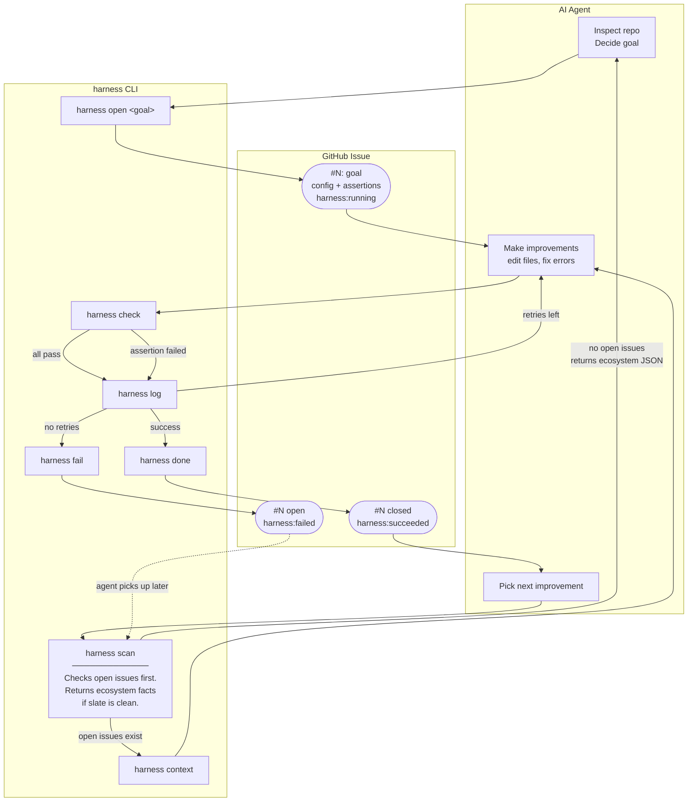

# harness-arena

**Autonomous repo improvement loop coordinator for AI coding agents.**

The GitHub Issue is the single source of truth — no local task files. Any agent on any machine picks up work by issue number alone.



No LLM bundled. Bring your own agent (Cursor, Claude Code, any coding AI).

---

## Usage

```bash
# 1. Scan the repo — checks open issues first; returns ecosystem facts if clear
harness scan ./my-repo --repo owner/repo

# 2. Inspect the repo, decide a goal, open a tracking issue
harness open "Fix all TypeScript strict errors" \
  --repo owner/repo \
  --workdir ./my-repo

# 3. Read prior context before starting (skip on first attempt)
harness context <issue>

# 4. Do the work — edit files, run commands, sanity-check locally

# 5. Verify assertions
harness check <issue>

# 6. Log what you did, push, then close
harness log <issue> "Fixed 12 type errors across src/. tsc clean."
git add -A && git commit -m "fix: resolve TypeScript strict errors" && git push
harness done <issue> 1
```

See [SKILL.md](./SKILL.md) for the full autonomous loop guide.

---

## Install

```bash
git clone https://github.com/theadamlabs/harness-arena
cd harness-arena
npm install && npm run build
npm install -g .
```

Requires `GITHUB_TOKEN` for GitHub Issues and `GITHUB_REPO=owner/repo` as default repo.

---

## Commands

```bash
harness scan    <workdir> [--repo R] [--goal "..."]       # check open issues; if clear, return ecosystem facts
harness open    "<goal>"  --repo R [--assert "cmd"]...    # open issue with inline assertions
harness check   <issue>  [--workdir override]             # run assertions, print PASS/FAIL + output
harness log     <issue>   "<message>"                     # add comment (attempts, errors, notes)
harness context <issue>                                   # read goal + config + all prior attempts
harness history [--repo R]                                # list all harness issues for the repo
harness done    <issue>  [attempts]                       # close as succeeded
harness fail    <issue>  [attempts]                       # mark as failed, leave open
harness help                                              # full reference
```

---

## How it works

The issue body stores everything harness needs in a hidden HTML comment:

```
<!-- harness:config
{"workdir":"/path/to/repo","assertions":[{"type":"shell","command":"npx tsc --noEmit","expect":{"exitCode":0}}]}
-->
```

`harness check 42` fetches issue #42, extracts the config, runs the assertions, and returns the full result including stdout/stderr — so the agent immediately sees what failed without needing a second command.

---

## Assertion types

**`shell`** — run a command, check its output:

| field         | meaning                                      |
|---------------|----------------------------------------------|
| `command`     | shell command to run                         |
| `exitCode`    | expected exit code, default `0`              |
| `contains`    | stdout+stderr must include this string       |
| `notContains` | stdout+stderr must NOT include this string   |
| `cwd`         | directory override (relative to workdir)     |

**`file`** — inspect a file on disk:

| field         | meaning                              |
|---------------|--------------------------------------|
| `path`        | path relative to workdir             |
| `exists`      | file must or must not exist          |
| `contains`    | file content must include string     |
| `notContains` | file content must NOT include string |

---

## Ecosystem auto-detection (`harness scan`)

`harness scan` reads the directory and generates sensible assertions automatically:

| Detected files                    | Ecosystem         | Assertions generated                   |
|-----------------------------------|-------------------|----------------------------------------|
| `package.json` + `tsconfig.json`  | TypeScript/Node   | `tsc --noEmit`, eslint, `npm test`     |
| `package.json`                    | Node.js           | `npm test`                             |
| `Cargo.toml`                      | Rust              | `cargo check`, `cargo clippy`, `cargo test` |
| `pyproject.toml` / `setup.py`     | Python            | ruff, mypy (if configured), `pytest`   |
| `go.mod`                          | Go                | `go build`, `go vet`, `go test`        |
| `Makefile`                        | Make              | `make test`, `make lint`, `make build` |

---

## GitHub Issues observability

| Event             | GitHub action                                          |
|-------------------|--------------------------------------------------------|
| `harness scan`    | Checks for open issues first; if any, returns them. If none, returns ecosystem JSON for agent to decide goal. |
| `harness open`    | Creates issue, embeds config, label `harness:running`  |
| Duplicate goal    | Returns existing open issue instead of creating new    |
| `harness log`     | Adds comment (attempt details, errors, diffs)          |
| `harness done`    | Closes issue, label `harness:succeeded`                |
| `harness fail`    | Labels `harness:failed`, leaves open for future agents |
| `harness context` | Fetches issue + all comments as structured JSON        |
| `harness history` | Lists all harness issues (running / succeeded / failed)|

---

## Project structure

```
src/
  types.ts     — HarnessConfig, Assertion, IssueContext interfaces
  scanner.ts   — ecosystem detection
  checker.ts   — assertion evaluation with rich stdout/stderr output
  reporter.ts  — GitHub Issues via @octokit/rest
  index.ts     — CLI entry point
SKILL.md       — agent usage guide (auto-installed to ~/.cursor/skills/)
```

---

## License

MIT
